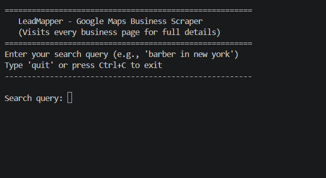
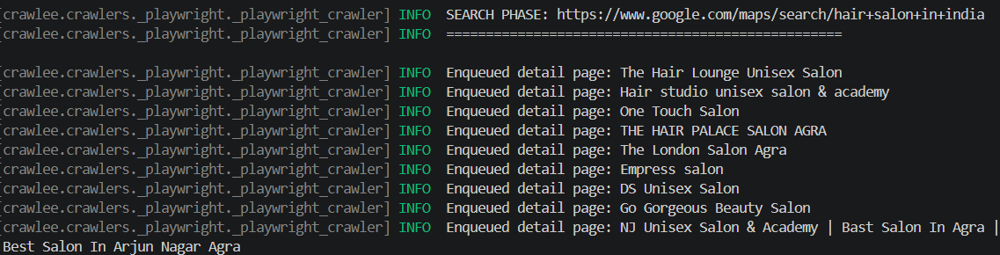
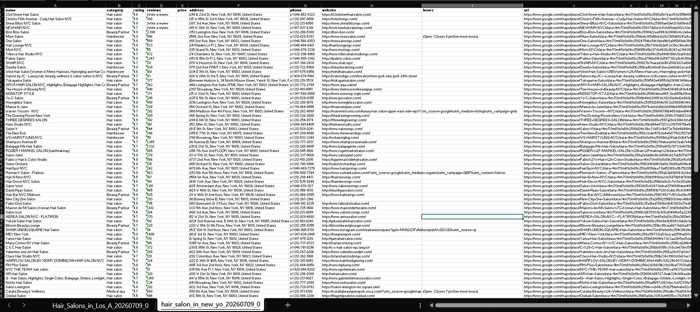
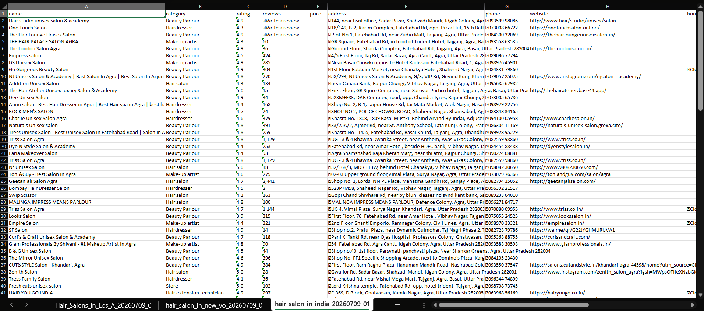

# LeadMapper

> A robust Python scraper that extracts full business details from Google Maps: including address, phone, website, hours, rating, and reviews by visiting every business detail page.

---

## Features

- **Two-Phase Scraping**
  1. **Search Phase** — Scrolls through Google Maps search results and collects every business link.
  2. **Detail Phase** — Visits each individual business page to extract comprehensive data.
- **Excel Export** — Each run appends a new sheet to a single `.xlsx` file, making it easy to accumulate data across multiple searches.
- **User Input Loop** — Interactive CLI prompts let you run multiple searches in one session.
- **Headless Browser** — Runs in the background via Playwright + Crawlee.
- **Auto Column Widths** — Exported Excel sheets are formatted for readability.

---

## Tech Stack

| Technology | Purpose |
|------------|---------|
| [Crawlee](https://crawlee.dev/python/) | Web crawling & request queue management |
| [Playwright](https://playwright.dev/python/) | Browser automation |
| [Pandas](https://pandas.pydata.org/) | Data manipulation |
| [OpenPyXL](https://openpyxl.readthedocs.io/) | Excel `.xlsx` file writing |

---

## Installation

### 1. Clone the repository

```bash
git clone https://github.com/technical404/LeadMapper
cd LeadMapper
```

### 2. Create a virtual environment (recommended)

```bash
python -m venv venv

# Windows
venv\Scripts\activate

# macOS / Linux
source venv/bin/activate
```

### 3. Install dependencies

```bash
pip install -r requirements.txt
```

### 4. Install Playwright browsers

```bash
playwright install
```

---

## Usage

Run the scraper from the terminal:

```bash
python scraper.py
```

You will be prompted to enter a search query. Example queries:

```
barber in new york
coffee shop in los angeles
plumber in chicago
dentist near me
```

After each search completes, choose whether to run another query. Each run appends a new sheet to `gmap_data.xlsx`.

### Output

| Column | Description |
|--------|-------------|
| `name` | Business name |
| `category` | Business category (e.g., "Hair salon") |
| `rating` | Star rating (e.g., "4.5") |
| `reviews` | Number of reviews |
| `price` | Price level ($ / $$ / $$$) |
| `address` | Full street address |
| `phone` | Phone number |
| `website` | Business website URL |
| `hours` | Opening hours summary |
| `url` | Google Maps detail page URL |

---

### 1. Terminal — Interactive Search Prompt



*The CLI prompts for a search query and shows live progress as detail pages are scraped.*

---

### 2. Scraping Progress — Detail Pages



*Live logging showing enqueued detail pages and extracted data per business.*

---

### 3. Excel Output — Formatted Data Sheet



*Each run creates a new sheet with auto-sized columns and clean business data.*

---

### 4. Multiple Sheets — Accumulated Searches



*Running multiple queries appends each result set as a separate sheet in the same workbook.*

---

## Configuration

You can tweak the scraper behavior by modifying these parameters in `scraper.py`:

| Parameter | Default | Description |
|-----------|---------|-------------|
| `headless` | `True` | Run browser in background (`False` opens a visible window) |
| `timeout_minutes` | `10` | Max time per crawl before timeout |
| `output_file` | `gmap_data.xlsx` | Output Excel file path |

Example:

```python
scraper = GoogleMapsScraper(headless=False, timeout_minutes=15)
```

---

## Important Notes

- **Rate Limiting**: Google Maps may throttle or block rapid requests. If scraping fails, increase delays or reduce concurrency.
- **Selector Fragility**: Google Maps updates its DOM frequently. If fields return empty, the CSS selectors in `_handle_detail_page` may need updating.
- **Timeout**: Detail-page scraping is slow. A query with 100 results can take 5–15 minutes depending on connection speed.
- **Legal Compliance**: Ensure your use complies with [Google Terms of Service](https://policies.google.com/terms) and local data protection laws.

---

## Troubleshooting

| Issue | Solution |
|-------|----------|
| `playwright not found` | Run `playwright install` after `pip install` |
| Empty Excel file / no data | Check that Google Maps loads correctly; selectors may need updating |
| `TimeoutError` | Increase `timeout_minutes` or reduce search scope |
| `ValidationError for Request` | Ensure you are using `Request.from_url()` (not raw dicts) when enqueuing |

---

## License

MIT License — see [LICENSE](LICENSE) for details.

---

> Built with ❤️ using [Crawlee](https://crawlee.dev/python/) & [Playwright](https://playwright.dev/python/)
